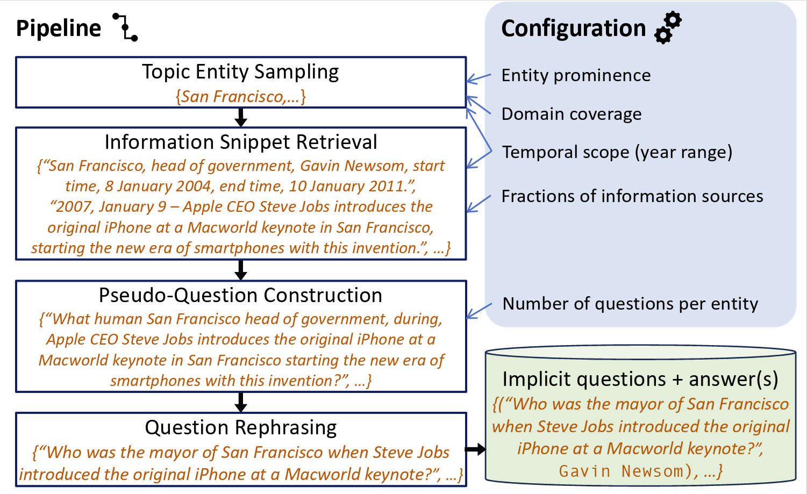

# Temporal Implicit Questions (TIQ)

Description
------

This code is for the TIQ benchmark proposed in our WWW'24 full paper "Faithful Temporal Question
Answering over Heterogeneous Sources".
Please visit the following repo [LINK](https://github.com/zhenjia2017/FAITH) to access the code for the FAITH method.

In this paper, we construct a new benchmark with focus on implicit temporal questions.

<div style="text-align: center;"></div>

This construction process operates as follows:

- (i) sample a set of topic entities to start with;
- (ii) retrieve temporal information snippets for each such topic entity from Wikipedia text, Wikipedia infoboxes, and
  Wikidata;
- (iii) concatenate information snippets using a suitable temporal signal and construct an interrogative sentence, a
  pseudo-question;
- (iv) rephrase the pseudo-question into a natural question using a
  generative model.

For more details see our
paper: [Faithful Temporal Question Answering over Heterogeneous Sources](https://arxiv.org/abs/2402.15400) and visit our
project website: https://qa.mpi-inf.mpg.de/tiq.

If you use this code, please cite:

```bibtex
@article{jia2024faithful,
  title={Faithful Temporal Question Answering over Heterogeneous Sources},
  author={Jia, Zhen and Christmann, Philipp and Weikum, Gerhard},
  journal={arXiv preprint arXiv:2402.15400},
  year={2024}
}
```

## Environment setup

We recommend the installation via conda, and provide the corresponding environment file
in [environment.yml](environment.yml):

```bash
  git clone https://github.com/zhenjia2017/TIQ.git
  cd TIQ/
  conda env create --file environment.yml
  conda activate tiq
  pip install -e .
```

Alternatively, you can also install the requirements via pip, using the [requirements.txt](requirements.txt) file.

### Dependencies

TIQ makes use of [CLOCQ](https://github.com/PhilippChr/CLOCQ) for retrieving facts from WIKIDATA.
CLOCQ can be conveniently integrated via the [publicly available API](https://clocq.mpi-inf.mpg.de), using the client
from [the repo](https://github.com/PhilippChr/CLOCQ).

### Data

You need the following data. You can download
from [here](https://qa.mpi-inf.mpg.de/faith/data_for_reproduce_faith.tar.gz):

- wikipedia_wikidata_mappings.pickle
- wikipedia_mappings.pickle
- wikidata_mappings.pickle
- types.pickle
- labels.pickle
- augmented_wikidata_mappings.pickle

### Benchmark Construction Pipeline

To construct the benchmark requires following major steps.

#### 1. Retrieve year pages

```bash
  bash scripts/pipeline.sh --year-page-retrieve <PATH_TO_CONFIG>
```

#### 2. Construct pseudo-questions

```bash
  bash scripts/pipeline.sh --pseudoquestion-generate <PATH_TO_CONFIG>
```

#### 3. Rephrase pseudo-questions

```bash
  bash scripts/pipeline.sh --question-rephrase <PATH_TO_CONFIG>
```

[//]: # (## Feedback)

[//]: # (The FAITH project by [Zhen Jia]&#40;zjia@swjtu.edu.cn&#41;, [Philipp Christmann]&#40;pchristm@mpi-inf.mpg.de&#41; and [Gerhard Weikum]&#40;weikum@mpi-inf.mpg.de&#41; is licensed under [MIT license]&#40;&#41;.)

[//]: # (## License)

[//]: # (The FAITH project by [Zhen Jia]&#40;zjia@swjtu.edu.cn&#41;, [Philipp Christmann]&#40;pchristm@mpi-inf.mpg.de&#41; and [Gerhard Weikum]&#40;weikum@mpi-inf.mpg.de&#41; is licensed under [MIT license]&#40;&#41;.)


